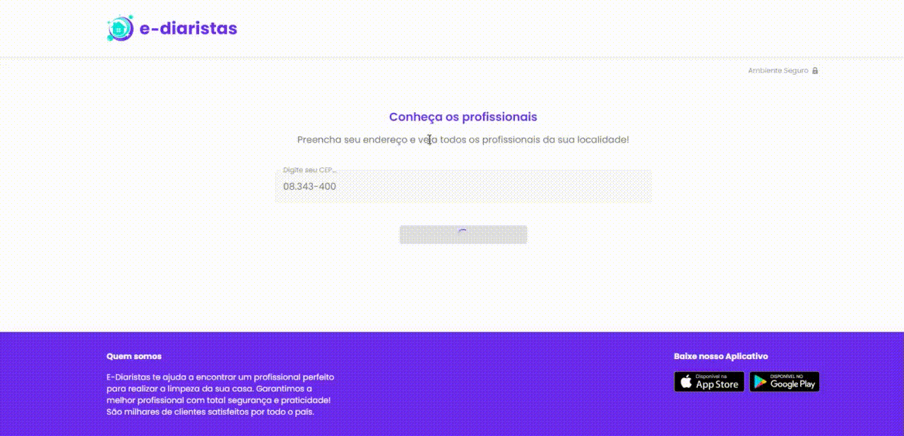

# 

<center>  </center>

  ## 📒 Sobre o Ediaristas
  O Ediarista foi um projeto desenvolvido na Semana MultiStack da Treinaweb, em que consiste em uma Aplicação Web e Mobile.
  Onde Diaristas podem se cadastrar na aplicação e assim prestar seus serviços, e caso os usuários queiram esses serviços,
  entram então no app e "contratam" o diarista a partir da sua localização(CEP)
  Usando uma API para validações de endereço feita no Python com o Framework Django.
  
  ## 🌟 Tecnologias Usadas
  Essa aplicação foi desenvolvida com as seguintes tecnologias:
  
  - [React](https://reactjs.org/)
  - [Django](https://www.djangoproject.com/)

  ## 💾 Instalando os Programas Necessários
  Para instalar os programas use esse comando:
  ```
  npm
  ```
  - Caso não tenha o npm siga o passo a passo de como instalar no seguinte link: https://docs.npmjs.com/about-npm-versions & https://docs.npmjs.com/downloading-and-installing-node-js-and-npm)

  Para iniciar o projeto no navegador utilize este comando:
  ```
  npm run dev
  ```
